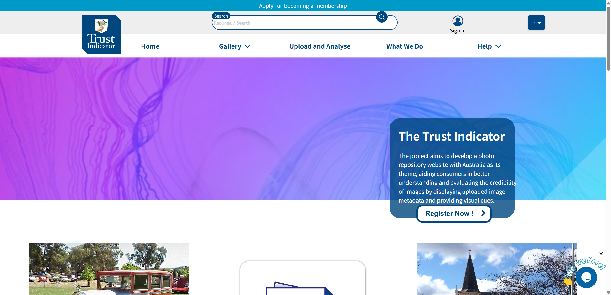
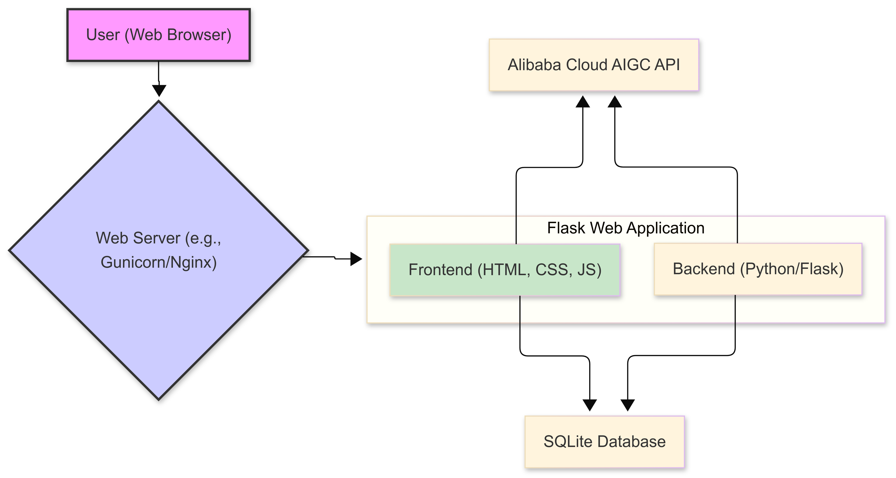
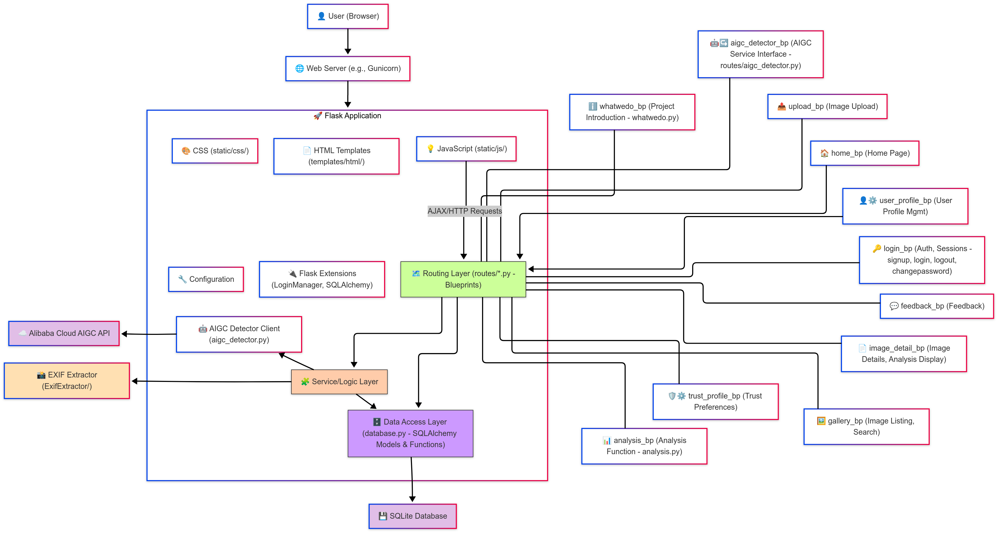
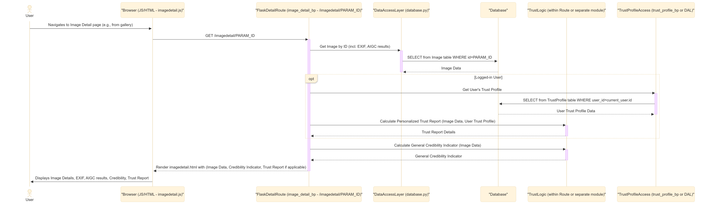
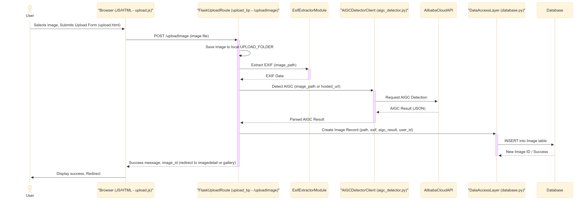

# Trust-Indicator

## Project Description
  
- **Developers:** COMP8715 Computing Project, Australian National University, Australia 2025 S1
  
- **Background:** With the widespread use of social media and online digital media, the authenticity of photos and creative images has become a global concern. In this digital age, the extensive dissemination of images and advanced editing techniques make it difficult for ordinary users and consumers to discern the authenticity and credibility of images. Misleading, manipulated, or artificially generated images can lead to inaccurate and confusing information dissemination.
  
- **Objective:** The project aims to develop a photo repository website with Australia as its theme, aiding consumers in better understanding and evaluating the credibility of images by displaying uploaded image metadata and providing visual cues. The website will be an open-source project, allowing users to upload their own images while adhering to knowledge-sharing (CC) license requirements. By collecting image metadata and displaying credibility signals, the website will assist users in identifying and discerning authentic images. Additionally, website members can contribute contextual information, such as photographer statements, to provide more background details.
The project's objective is to offer consumers a reliable resource to improve their ability to judge image authenticity. It also provides photographers and creators with a platform to showcase their works and offer additional information, enhancing public understanding and awareness of images. By being an open-source project, the website encourages other developers to contribute and improve, facilitating ongoing project development and enhancement.

## Acknowledgements

We would like to extend our sincere gratitude to the previous team for their valuable contributions to the project. Their hard work and dedication have laid a solid foundation for us to build upon.

For detailed information about the previous team's work, please refer to the materials provided at [total-project-introduction](./docs/total-project.md)

## Website

[picture.au](https://picture.au)

## Structure

