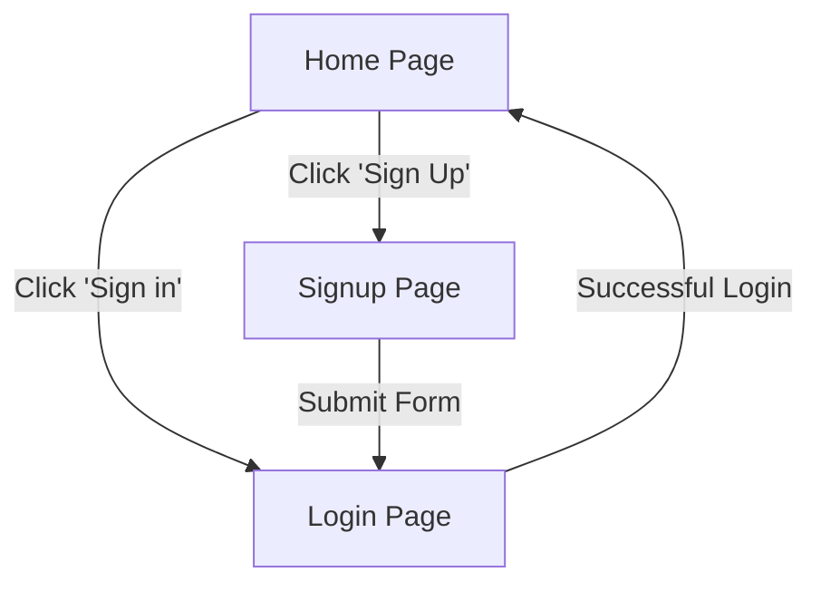
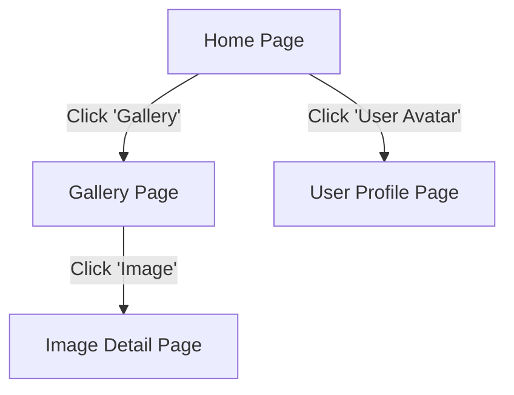
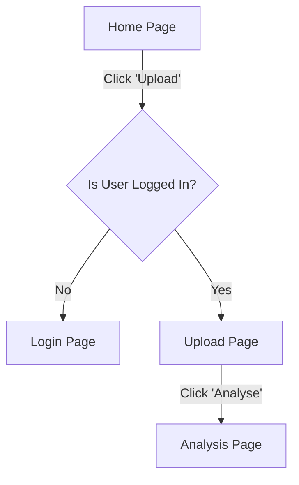

# Page

This document lists the pages we have developed till now.

| **API Endpoint**          | **Description**      |
| ------------------------- | -------------------- |
| **`GET /`**               | Home page            |
| **`GET /signup`**         | Signup page          |
| **`GET /login`**          | Login page           |
| **`GET /upload`**         | Upload page          |
| **`GET /userprofile`**    | User profile page    |
| **`GET /whatwedo`**       | About us page        |
| **`GET /changepassword`** | Change password page |
| **`GET /analysis`**       | Image analysis page  |
| **`GET /imagedetail`**    | Image details page   |
| **`GET /feedback`**       | Feedback page        |
| **`GET /gallery`**        | Gallery page         |

